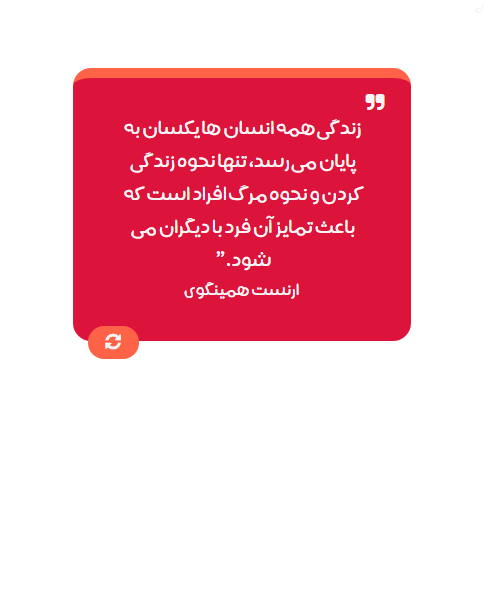
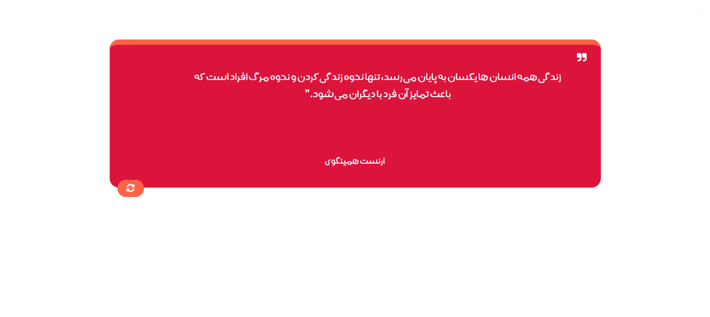

### Next Quotation 
#### is a template  to showing great quotes with refresh capability

### How to runing this template?

1. First clone project `https://github.com/Qiamast/Next_Quotation.git`
2. open prject folder on your code editor like  `VS CODE`
3. Install LiveSever Plugin on VS Code ` LiveServer Plugin for VS Code`
4. open `index.html` with LiveServer
5. Now you Can see that
6. 
